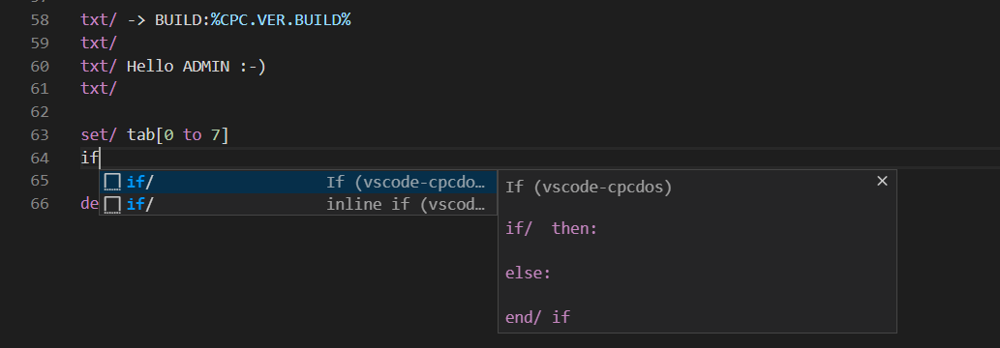

# vscode-cpcdos

[][license]
[][vscode-marketplace]
[][vscode-marketplace-rating]

CpcdosC+ language support for Visual Studio Code

[license]: LICENSE
[vscode-marketplace]: https://marketplace.visualstudio.com/items?itemName=d0p1.vscode-cpcdos
[vscode-marketplace-rating]: https://marketplace.visualstudio.com/items?itemName=d0p1.vscode-cpcdos&ssr=false#review-details